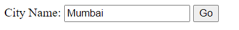

# Weather-Project

**_Displays the current weather details for cities entered by users_**

This website gets the city name as input from the user and displays the current weather data in that city

**_Node.js_** is used

Weather deatils is obtained from https://openweathermap.org using api

